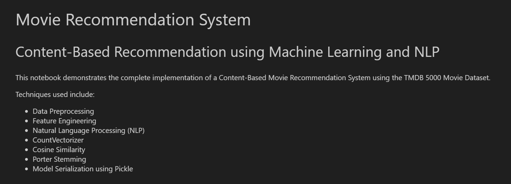
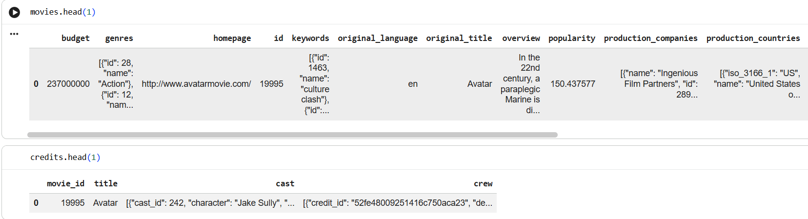
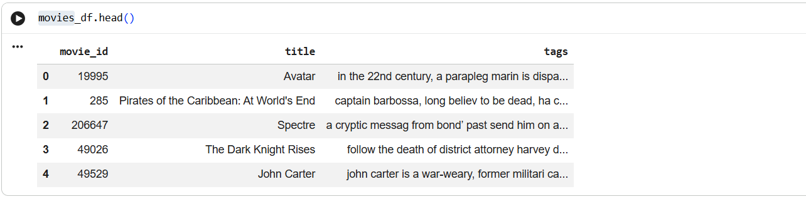
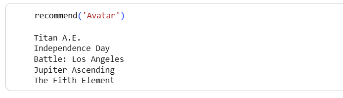

# Movie Recommendation System

A Machine Learning based **Content-Based Movie Recommendation System** that recommends similar movies by analyzing movie metadata such as genres, keywords, cast, crew, and overview.

The project uses Natural Language Processing (NLP) techniques and cosine similarity to recommend movies with similar content.

---

## Overview

Recommendation systems are widely used in streaming platforms such as Netflix, Amazon Prime Video, Disney+, and YouTube.

This project implements a **Content-Based Recommendation System**, where recommendations are generated based on the similarity between movies instead of user viewing history.

---

## Features

* Content-Based Movie Recommendation
* Data Cleaning and Preprocessing
* Feature Engineering
* NLP-based Text Processing
* Porter Stemming using NLTK
* Vectorization using CountVectorizer
* Cosine Similarity Calculation
* Movie Recommendation Function
* Model Serialization using Pickle

---

## Dataset

This project uses the **TMDB 5000 Movie Dataset**.

Dataset files:

* tmdb_5000_movies.csv
* tmdb_5000_credits.csv

These datasets contain information such as:

* Movie Title
* Genres
* Keywords
* Cast
* Crew
* Overview

---

## Technologies Used

* Python
* Pandas
* NumPy
* NLTK
* Scikit-learn
* Pickle
* Google Colab 

---

## Machine Learning Workflow

1. Load movie and credits datasets.
2. Merge datasets using the movie title.
3. Remove missing values.
4. Extract useful features:

   * Genres
   * Keywords
   * Top 3 Cast Members
   * Director
   * Overview
5. Perform text preprocessing.
6. Apply Porter Stemming using NLTK.
7. Convert text into numerical vectors using CountVectorizer.
8. Compute cosine similarity between movies.
9. Recommend the most similar movies.
10. Save the processed data and similarity matrix using Pickle.

---

## Project Structure

```text

movie-recommendation-system/

├── dataset/
│   ├── tmdb_5000_movies.csv
│   └── tmdb_5000_credits.csv
│
├── notebooks/
│   └── movie-recommendation-system.ipynb
│
├── models/
│   ├── movies.pkl
│   └── similarity.pkl
│
├── screenshots/
│
├── README.md
├── requirements.txt
└── .gitignore
```

## How to Run

1. Clone the repository.

```bash
git clone https://github.com/PRANAVPANJABI/movie-recommendation-system.git
```

2. Navigate to the project folder.

```bash
cd movie-recommendation-system
```

3. Install the required dependencies.

```bash
pip install -r requirements.txt
```

4. Open the notebook.

```
notebooks/movie-recommendation-system.ipynb
```

5. Run all notebook cells sequentially.

6. Use the `recommend()` function to generate movie recommendations.

Example:

```python
recommend("Avatar")
```
---

## Example Recommendation

Input

```text
Avatar
```

Example Output

```text
Titanic
John Carter
Guardians of the Galaxy
Aliens
The Abyss
```

*(Actual recommendations may vary depending on preprocessing and dataset version.)*

---

## Project Screenshots

### Project Overview



---

### Dataset Preview



---

### Feature Engineering



---

### Recommendation Output



## Skills Demonstrated

* Machine Learning
* Natural Language Processing (NLP)
* Feature Engineering
* Data Preprocessing
* Recommendation Systems
* Vector Space Model
* Cosine Similarity
* Python Programming

---

## Future Improvements

* Build a web application using Streamlit or Flask.
* Add movie posters using the TMDB API.
* Improve recommendations using hybrid filtering.
* Deploy the project online.
* Add search suggestions and autocomplete.

---

## Author

**Pranavkumar Panjabi**


